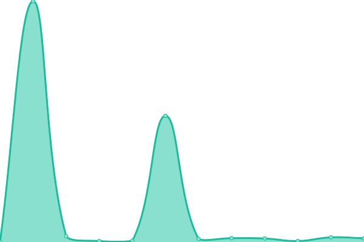

# [📈 Live Status](https://statuspage.fitwel.org): <!--live status--> **🟩 All systems operational**

This repository contains the open-source uptime monitor and status page for [Center for Active Design](https://app.fitwel.org), powered by [Upptime](https://github.com/upptime/upptime).

With [Upptime](https://upptime.js.org), you can get your own unlimited and free uptime monitor and status page, powered entirely by a GitHub repository. We use [Issues](https://github.com/c4ad/upptime-tool/issues) as incident reports, [Actions](https://github.com/c4ad/upptime-tool/actions) as uptime monitors, and [Pages](https://statuspage.fitwel.org) for the status page.

<!--start: status pages-->
<!-- This summary is generated by Upptime (https://github.com/upptime/upptime) -->
<!-- Do not edit this manually, your changes will be overwritten -->
<!-- prettier-ignore -->
| URL | Status | History | Response Time | Uptime |
| --- | ------ | ------- | ------------- | ------ |
|  [Fitwel Portal Front-End](https://app.fitwel.org) | 🟩 Up | [fitwel-portal-front-end.yml](https://github.com/c4ad/uptime-tool/commits/HEAD/history/fitwel-portal-front-end.yml) | 

 222ms
     
 | 

<a href="https://statuspage.fitwel.org/history/fitwel-portal-front-end">100.00%</a>
    

|  [Fitwel Portal Back-End](https://api.fitwel.org/health) | 🟩 Up | [fitwel-portal-back-end.yml](https://github.com/c4ad/uptime-tool/commits/HEAD/history/fitwel-portal-back-end.yml) | 

 811ms
     
 | 

<a href="https://statuspage.fitwel.org/history/fitwel-portal-back-end">99.92%</a>
    

|  [E-mail Notification Service](https://adai.app.n8n.cloud) | 🟩 Up | [e-mail-notification-service.yml](https://github.com/c4ad/uptime-tool/commits/HEAD/history/e-mail-notification-service.yml) | 

 1078ms
     
 | 

<a href="https://statuspage.fitwel.org/history/e-mail-notification-service">100.00%</a>
    

<!--end: status pages-->

[**Visit our status website →**](https://statuspage.fitwel.org)

## 📄 License

- Powered by: [Upptime](https://github.com/upptime/upptime)
- Code: [MIT](./LICENSE) © [Center for Active Design](https://app.fitwel.org)
- Data in the `./history` directory: [Open Database License](https://opendatacommons.org/licenses/odbl/1-0/)
